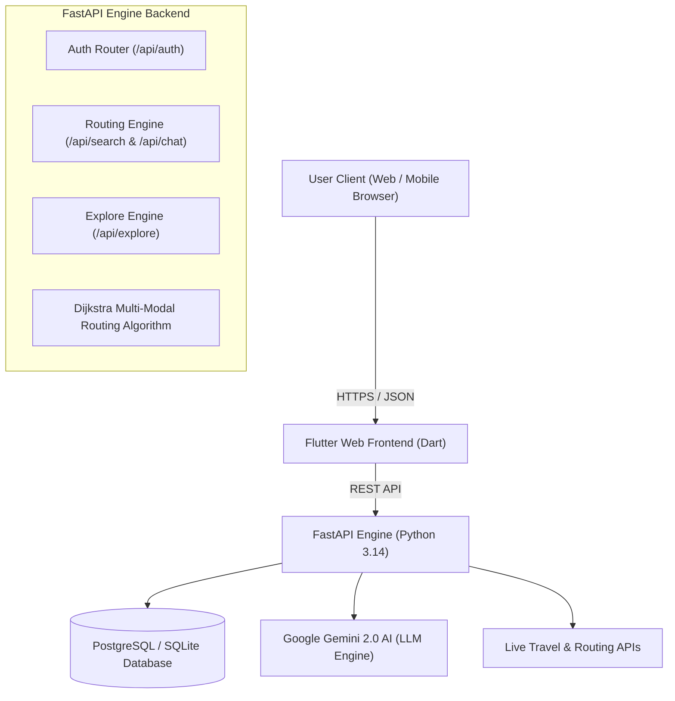

# 📄 Product Requirement Document (PRD)
## AI Travel Copilot — Next-Gen Multi-Modal Travel & Exploration Engine

---

### 📌 Document Control & Metadata
- **Product Name**: AI Travel Copilot
- **Version**: 2.0 (Production Release)
- **Document Status**: Final / Approved
- **Live Deployed Frontend**: [travel-copilot-ai.netlify.app](https://travel-copilot-ai.netlify.app)
- **Live Deployed Backend API**: [travel-copilot-ai.onrender.com](https://travel-copilot-ai.onrender.com)
- **GitHub Repository**: [Mithilesh1310/travel-copilot-ai](https://github.com/Mithilesh1310/travel-copilot-ai.git)

---

## 1. Executive Summary & Vision

### 1.1 Problem Statement
Modern travel planning is fragmented and stressful. Users switch between multiple apps to compare flights, trains, intercity cabs, local metro routes, hotel costs, and emergency facilities. Furthermore, traditional search tools lack dynamic date-aware conversational AI and force rigid input structures without hyper-local pickup context (e.g., cab fare to the nearest airport or railway station from a specific college campus or landmark).

### 1.2 Product Vision
**AI Travel Copilot** is a unified, AI-powered multi-modal travel engine and personal concierge. It combines real-time route optimization across **Flights, Rail, Metro, Cabs (Uber/Ola), and Buses** with conversational AI intelligence, real-time budget forecasting, hyper-local mission exploration, and an emergency safety network.

### 1.3 Key Target Audience
- **Frequent Travelers & Business Professionals**: Seeking fast, non-stop, low-risk routes.
- **Budget Travelers & Students**: Needing cheapest multi-modal connections (e.g., PSIT Kanpur to Bangalore).
- **Eco-Conscious Explorers**: Preferring low-emission rail and green bus connections.
- **International Tourists**: Requiring entry guidance, visa breakdown, and local emergency support.

---

## 2. Technical Stack & Architecture

### 2.1 Technology Stack

| Layer | Technology / Framework | Details |
| :--- | :--- | :--- |
| **Frontend Framework** | **Flutter Web & Cross-Platform (Dart)** | Single codebase compiling to Web Release JS bundle & Mobile apps. |
| **Default UI Theme** | **Adaptive Light Mode (Default) + Dark Mode** | Modern glassmorphic cards, custom typography, micro-animations. |
| **Backend Framework** | **FastAPI (Python 3.14 + Uvicorn)** | High-performance asynchronous REST API framework. |
| **AI LLM Engine** | **Google Gemini 2.0 Flash / Lite + Fallback Parser** | Natural language intent extraction, date parsing, and route explanations. |
| **Database** | **PostgreSQL (Production) / SQLite (Dev)** | Persistent user profiles, saved itineraries, and analytics. |
| **ORMs & Drivers** | **SQLAlchemy & Alembic** | Database ORM mapping with automated migrations. |
| **Hosting & Deployment**| **Netlify (Frontend) + Render (Backend)** | Continuous deployment via GitHub `main` branch. |

---

## 3. Core Feature Specifications

### 3.1 Split-Screen Luxury Auth Gate & Session Management
- **Hero Presentation Card (Left)**:
  - 4-second automatic cross-fade slideshow featuring HD travel destination photography (**Swiss Alps 🇨🇭**, **Mountain Flight ✈️**, **Santorini 🇬🇷**, **Paris 🇫🇷**).
  - Dynamic location pill badges and interactive progress bars for manual slide switching.
  - Official brand title: `TRAVEL COPILOT | AI Travel Copilot`.
- **Form Card (Right)**:
  - Toggle between **Sign In** and **Create Account**.
  - Side-by-side First/Last Name, Email, and Password with visibility toggle (`👁️`).
  - Google OAuth single-click authentication & Apple Sign-In triggers.
- **Session Persistence**:
  - Instant local cache restoration (`SharedPreferences`) on startup with 0ms UI delay to handle backend cold-starts gracefully without logging users out.

---

### 3.2 Universal Multi-Modal Route Finder
- **Route Inputs**:
  - **Origin Field**: Auto-suggests hyper-local spots (e.g., *PSIT Kanpur*, *Delhi*, *London*).
  - **Destination Field**: Global cities, countries, and local spots.
  - **One-Click Swap Button (`⇄`)**: Instantly swaps Origin and Destination values.
  - **📅 Departure Date Picker**: Dedicated date selector with calendar dialog (`showDatePicker`) supporting relative date parsing (*"Tomorrow"*, *"25th August"*, *"Next Monday"*).
  - **Budget Slider Threshold**: Interactive slider (₹1,000 – ₹100,000) with quick preset chips (₹5k, ₹15k, ₹45k, ₹75k).
- **AI Optimization Priorities**:
  - `✨ Best Value (Hybrid)`: Balanced speed, comfort, and price.
  - `💰 Cheapest Fare`: Prioritizes sleeper/3AC rail, economy bus, and budget flights.
  - `⚡ Fastest Non-Stop`: Direct flight + express airport cab links.
  - `🌿 Eco Friendly (CO2)`: Minimizes carbon emissions using electric rail & metro.
  - `🛡️ Lowest Delay Risk`: Selects routes with high historical on-time statistics.

---

### 3.3 Dynamic Conversational AI Assistant
- **Intent Extraction Engine**:
  - Automatically identifies origin, destination, travel date, and budget constraint from free-form user messages (e.g., *"Find me flights from Delhi to Mumbai for tomorrow under 5000"*).
  - Resolves relative time expressions dynamically relative to `today_str`.
- **Structured Response Format**:
  - **Header**: Explicitly displays `📅 Travel Departure Date: DD MMM YYYY (Day)`.
  - **Hyperlocal Pickup Breakdown**: Displays distance, travel time, and estimated Uber Go / Auto / Intercity cab fares from origin to nearest station/airport.
  - **Global Entry Advice**: Automatically attaches Passport validity requirements, Visa policy (E-Visa / ESTA), and airport baggage allowance for international destinations.
  - **Follow-up Chips**: Interactive 1-tap query suggestions.

---

### 3.4 Financial Advisor & Budget Dashboard
- **Expense Categorization**: Breakdown across Flights/Transit, Hotels, Food, Activities, and Emergency Reserves.
- **AI Forecast Report**: Analyzes remaining budget, provides cost-saving recommendations, and identifies potential overspending risks.

---

### 3.5 Explore Mode & Emergency Safety Net
- **Hyperlocal POI Missions**: Interactive map markers (`latlong2`) for historical spots, local food stalls, and photography locations.
- **Live In-App Navigation**: Real-time map centering and route guidance.
- **Emergency Safety Overlay**: Instant 1-tap access to nearest Hospitals, Police Stations, and Embassies with direct call and navigation triggers.

---

### 3.6 Admin Analytics & User Metrics
- **Admin Endpoint**: `GET /api/auth/admin/stats`
- **Key Metrics Tracked**:
  - Total registered user count.
  - Breakdown of Email vs Google OAuth signups.
  - Recent user registration timestamp log.

---

## 4. API Endpoints Reference

### 4.1 Authentication Endpoints (`/api/auth`)

| Endpoint | Method | Description |
| :--- | :--- | :--- |
| `/api/auth/register` | `POST` | Create a new user account (First, Last, Email, Password). |
| `/api/auth/login` | `POST` | Authenticate user and issue JWT Access Token. |
| `/api/auth/me` | `GET` | Retrieve logged-in user profile (Requires Bearer token). |
| `/api/auth/admin/stats` | `GET` | Return platform user metrics and analytics. |

### 4.2 Route Search & Chat Endpoints (`/api`)

| Endpoint | Method | Description |
| :--- | :--- | :--- |
| `/api/search` | `POST` | Execute Dijkstra multi-modal route optimization. |
| `/api/chat` | `POST` | Process AI conversational travel queries with intent parsing. |
| `/api/user/trips` | `POST` | Save a booked trip itinerary to user profile. |

### 4.3 Explore Endpoints (`/api/explore`)

| Endpoint | Method | Description |
| :--- | :--- | :--- |
| `/api/explore/plan` | `POST` | Generate customized POI itinerary for a city. |
| `/api/explore/missions` | `GET` | Fetch nearby mission challenges. |
| `/api/explore/emergency`| `GET` | Fetch emergency medical & security facilities. |

---

## 5. Non-Functional Requirements (NFRs)

1. **Performance**:
   - Frontend initial load under **1.8s** on 4G networks.
   - Route optimization API response time **< 450ms**.
2. **Reliability & Offline Handling**:
   - Zero-delay UI session restoration on web reload.
   - Offline fallback mock engine if backend server is warming up from cold-start.
3. **Usability & UX**:
   - Zero text label overlaps across all border lines in Light & Dark modes.
   - Fully responsive across Desktop (1920x1080), Tablet, and Mobile viewports (< 700px).
4. **Security**:
   - Password hashing via `passlib` with `bcrypt`.
   - JWT tokens signed with SHA-256 with 7-day expiration.

---

## 6. Future Release Roadmap (v3.0)

- [ ] **Live Flight Tracker**: Integration with FlightAware / AviationStack APIs.
- [ ] **IRCTC Train PNR Status**: Live train delay tracking and seat availability prediction.
- [ ] **Group Expense Splitting**: Shared travel wallet for trips with friends.
- [ ] **Voice-Activated Copilot**: Full two-way voice conversation mode using Web Speech API.

---
*Document maintained by AI Travel Copilot Engineering Team.*
