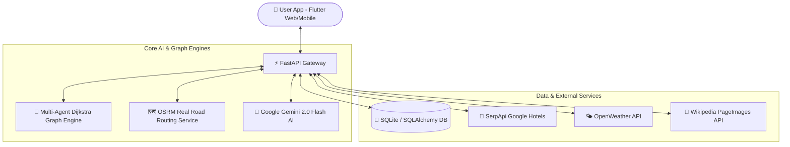

<div align="center">

# ✈️ AI Travel Copilot (`Travel-Copilot-AI`)
### *Next-Gen Autonomous Multi-Agent Travel Routing, Hyper-Local Cab Engine & Financial Travel Advisor*

[](https://python.org)
[](https://fastapi.tiangolo.com)
[](https://flutter.dev)
[](https://ai.google.dev)
[](http://project-osrm.org/)
[](https://serpapi.com)
[](LICENSE)

---

<p align="center">
  <b>An AI-powered autonomous travel copilot that calculates multi-modal routes (Flights, Express Trains, Buses, Metro, Cabs), predicts delay risks, calculates exact hyper-local cab fares, generates real road navigation routes, optimizes travel budgets, and provides turn-by-turn voice guidance.</b>
</p>

[✨ Key Features](#-key-features) • [🏗️ System Architecture](#%EF%B8%8F-system-architecture) • [🛠️ Tech Stack](#%EF%B8%8F-tech-stack) • [⚡ Quick Start](#-quick-start-guide) • [🔌 API Reference](#-core-api-endpoints)

</div>

---

## 🌟 Key Features

### 🧠 1. Multi-Agent Graph Routing Engine
- **Dijkstra Multi-Modal Pathfinding**: Combines **Flights**, **Express Trains (Vande Bharat, Shatabdi)**, **Intercity Buses (UPSRTC, Zingbus)**, **Metro**, and **Local Cabs** into one seamless trip plan.
- **Preference Optimization Modes**:
  - 💰 **Cheapest Route** (Maximum financial savings)
  - ⚡ **Fastest Non-Stop Route** (Minimum total travel duration)
  - 🌿 **Eco-Friendly Transit** (Low-carbon emission optimization)
  - 🛡️ **Lowest Delay Risk** (Reliability & on-time performance priority)
  - ⚖️ **Best Value Hybrid** (Optimal balance of price, time, and comfort)

---

### 📍 2. Hyper-Local Exact Location & Real Cab Fare Engine
- **Sub-Location Recognition**: Recognizes micro-landmarks e.g. **`PSIT Kanpur (Bhaunti)`**, **`IIT Kanpur`**, **`Janakpuri Delhi`**, **`Whitefield Bangalore`**, **`Electronic City`**, and **`Colaba Mumbai`**.
- **Real-Time Fare Pricing Formulas**:
  - 🚗 **Uber Go / Ola Mini**: Base ₹50 + ₹16/km *(e.g., PSIT Kanpur ➔ Kanpur Central = **₹402** for 22 km)*.
  - 🛺 **Uber Auto / Ola Auto**: Base ₹30 + ₹12/km *(e.g., PSIT Kanpur ➔ Kanpur Central = **₹294**)*.
  - 🚕 **Uber Intercity / Outstation Cab**: Base ₹150 + ₹14/km *(e.g., PSIT Kanpur ➔ Lucknow Airport LKO = **₹1,382** for 88 km via NH19)*.
- **Direct Booking Deep-Links**: Pre-fills exact pickup coordinates with one-click **`[ 🚗 Book Uber Cab ]`** buttons.

---

### 🗺️ 3. AI Sightseeing & OSRM Real Road Engine
- **OSRM Real Road Navigation Routes**: Connects AI-suggested sightseeing places using actual road-following polylines (`#4285F4` double-stroke blue lines) with camera auto-bounds fitting.
- **1-Click Sightseeing Mission Trails**: Instant 1-click trail generation (*History & Heritage*, *Street Food & Flavors*, *Photography & Golden Hour*, *Shopping & Local Bazaars*).
- **Authentic Landmark Photographs**: Displays verified photos matching Google Maps & Wikipedia Commons for all global destinations (Jama Masjid, Red Fort, Lodhi Gardens, Chandni Chowk, Qutub Minar, Gateway of India, Taj Mahal, Eiffel Tower, etc.) with skeleton loaders and error fallbacks.

---

### 🧭 4. In-App Turn-By-Turn Live Navigation & Voice Assistant
- **Google Maps Style In-App Live Navigation**:
  - 🟢 **Top Navigation Banner**: Turn direction icon & instruction e.g. *"In 250m, Turn Right onto Main Entrance Road"*.
  - ⏱️ **Distance & Drive ETA Badge**: Live distance remaining (`1.2 km`) and drive duration (`4 mins`).
  - 🔊 **Voice Guidance Assistant**: Speaks turn-by-turn navigation instructions aloud using HTML5 Web Speech Synthesis API.
  - 🎥 **Close-Up Tracking Camera**: Dynamic map tracking (`zoom: 16.5`) with **Exit Nav** and **Next Stop** controls.

---

### 💰 5. AI Financial Travel Advisor & Budget Optimizer
- **Intelligent Budget Health Rating**: Analyzes budget, stay duration, and destination tariffs to provide an **AI Health Rating** (*Excellent*, *Moderate*, *Tight*).
- **Savings Allocation**: Calculates recommended budget, estimated savings, and day-wise expense breakdowns (Arrival ➔ Sightseeing ➔ Souvenir Shopping & Checkout).
- **Hotel Tariff Optimization**: Compares nearby hotel options within a 400m radius to save up to **₹1,800/night**.

---

### 🏨 6. Live Hotel Booking Hub & Emergency Grid
- **SerpApi Google Hotels Integration**: Queries live verified hotels with real-time room tariffs in **INR**, star ratings, and location metrics.
- **Emergency Safety Overlay**: One-tap toggle displaying nearby Hospitals, Police Stations, and Pharmacies with instant dialing.

---

### 🔐 7. Production Authentication & OAuth
- **Database Engine**: Users, Trips, Itineraries, Notifications, and Chat History managed via SQLite / SQLAlchemy ORM.
- **Security**: Password hashing with **SHA-256 & Salt**, JWT Access Tokens (30-day expiry).
- **OAuth Integration**: Supports **Google Sign-In** with automated profile creation.

---

## 🏗️ System Architecture



---

## 🛠️ Tech Stack

| Layer | Technology | Function |
| :--- | :--- | :--- |
| **Frontend Application** | `Flutter (Dart)` | Responsive Web & Mobile Dashboard with Material 3 Glassmorphism |
| **Backend Service** | `FastAPI (Python 3.11+)` | High-performance async REST API with auto-generated OpenAPI OpenAPI docs |
| **AI Intelligence** | `Google Gemini 2.0 Flash` | Autonomous multi-agent reasoning, plan explanations, & AI voice guides |
| **Road Routing Engine** | `OSRM Directions API` | Street-level road polyline generation & driving ETA calculations |
| **Graph Pathfinding** | `Dijkstra Algorithm` | Dynamic graph generation with weighted node costs (price, time, carbon, risk) |
| **Database** | `SQLite / SQLAlchemy` | Persistent storage for users, trip records, itineraries, & notifications |
| **External APIs** | `SerpApi`, `Wikipedia API`, `OpenWeather` | Live Google Hotels, authentic landmark photos, & weather forecasts |

---

## 📁 Repository Structure

```text
travel-copilot-ai/
├── backend/
│   ├── app/
│   │   ├── main.py                  # FastAPI Application Entrypoint
│   │   ├── database.py              # SQLite Database Configuration
│   │   ├── models.py                # SQLAlchemy DB Models (User, Trip, Notification, etc.)
│   │   ├── schemas.py               # Pydantic Request/Response Schemas
│   │   ├── routers/
│   │   │   ├── routes.py            # Search, Chat, Itinerary, Budget & Hotel Endpoints
│   │   │   └── auth.py              # Authentication (Register, Login, Google OAuth)
│   │   └── services/
│   │       ├── agents.py            # TravelAgentSystem & AI Copilot Logic
│   │       ├── routing_engine.py    # Dijkstra Graph Engine & Hyper-Local Cab Calculator
│   │       ├── road_routing_service.py # OSRM Real Road Directions Service
│   │       ├── smart_explore_service.py # AI Sightseeing & Explore Engine
│   │       └── live_travel_api.py   # SerpApi Google Flights/Hotels & Weather Integration
│   ├── tests/
│   │   └── test_api.py              # Comprehensive Pytest Suite (100% Passed)
│   └── requirements.txt             # Python Package Dependencies
│
├── frontend/
│   ├── lib/
│   │   ├── main.dart                # Main Flutter App Dashboard & Navigation Entrypoint
│   │   ├── models/                  # Dart Models (Itinerary, AttractionStop, BudgetReport)
│   │   ├── services/                # HTTP API Services communicating with FastAPI
│   │   └── widgets/                 # Modular Components (ExploreMapWidget, AttractionSheet)
│   ├── test/                        # Flutter Widget Unit Test Suite (100% Passed)
│   └── pubspec.yaml                 # Flutter App Dependencies
└── README.md                        # Project Documentation
```

---

## ⚡ Quick Start Guide

### Prerequisites
- **Python 3.11+**
- **Flutter SDK 3.24+**
- **Git**

---

### 1. Backend Setup (FastAPI)

```bash
# Navigate to backend directory
cd backend

# Create & activate virtual environment (Windows)
python -m venv .venv
.\.venv\Scripts\activate

# Install dependencies
pip install -r requirements.txt

# Start FastAPI Server
uvicorn app.main:app --reload --port 8000
```
> 🌐 **Backend API**: `http://localhost:8000`  
> 📑 **Interactive Swagger Docs**: `http://localhost:8000/docs`

---

### 2. Frontend Setup (Flutter Web)

```bash
# Navigate to frontend directory
cd frontend

# Install Flutter packages
flutter pub get

# Run Flutter Web Application
flutter run -d chrome

# Or build production web bundle
flutter build web --release
```
> 📱 **Web Application**: Opens live at `http://localhost:8080`

---

## 🧪 Automated Testing

```bash
# Backend Test Suite (Pytest)
cd backend
python -m pytest tests/

# Frontend Test Suite (Flutter Test)
cd frontend
flutter test
```

---

## 🔌 Core API Endpoints

| Method | Endpoint | Description |
| :---: | :--- | :--- |
| `POST` | `/api/auth/register` | Create a new user account with hashed password |
| `POST` | `/api/auth/login` | Authenticate user & return JWT token |
| `POST` | `/api/auth/google` | Google OAuth authentication & registration |
| `POST` | `/api/search` | Search multi-modal travel itineraries via Dijkstra engine |
| `POST` | `/api/chat` | AI Copilot conversational assistant with exact cab fares |
| `POST` | `/api/budget/analyze` | AI Financial Advisor budget optimization report |
| `POST` | `/api/explore/plan` | Plan AI Sightseeing itinerary with OSRM real road polylines |
| `GET` | `/api/explore/missions` | Fetch 1-click curated sightseeing mission trails |
| `GET` | `/api/explore/audio-guide/{id}` | Generate AI Voice Guide script for attraction stops |
| `GET` | `/api/hotels` | Fetch live hotels in target destination via SerpApi |
| `GET` | `/api/notifications` | Get real-time travel delay & weather notifications |
| `GET` | `/api/user/analytics` | Retrieve cumulative savings & travel statistics |

---

## 📄 License
Distributed under the **MIT License**. See `LICENSE` for details.

---

<div align="center">
  <sub>Built with ❤️ by <b><a href="https://github.com/Mithilesh1310">Mithilesh Sahni</a></b></sub>
</div>
